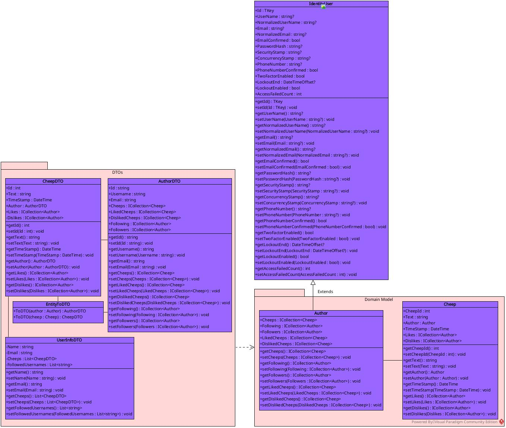
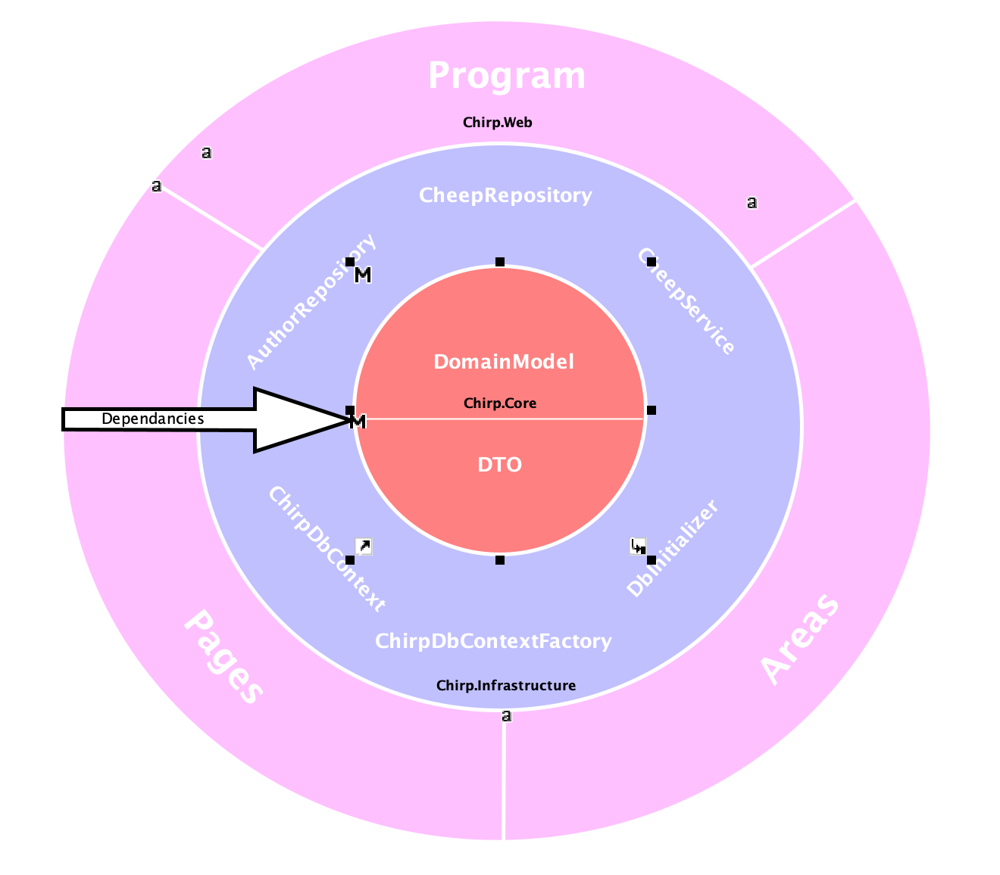
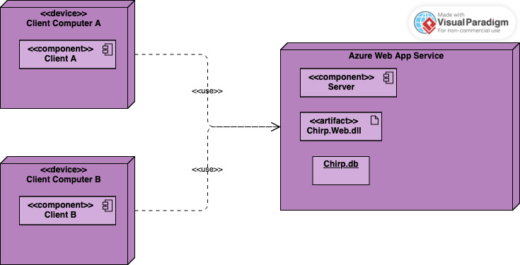
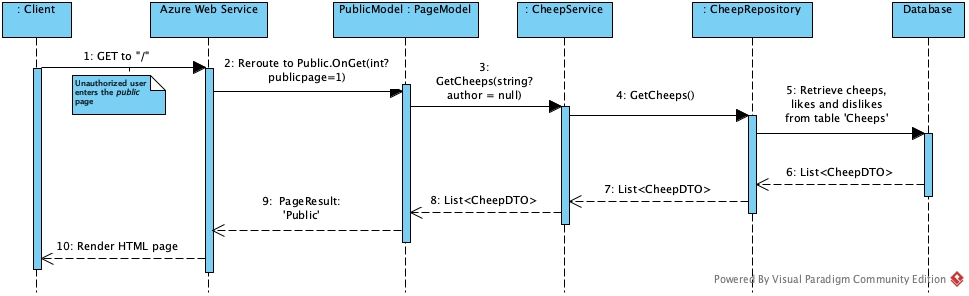
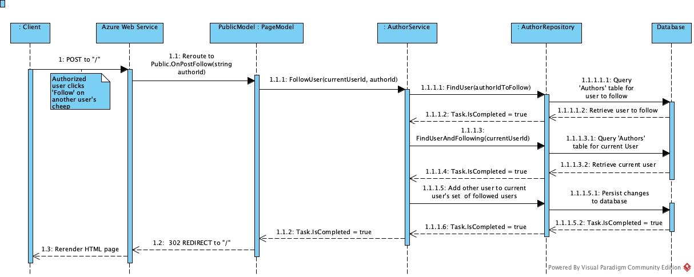
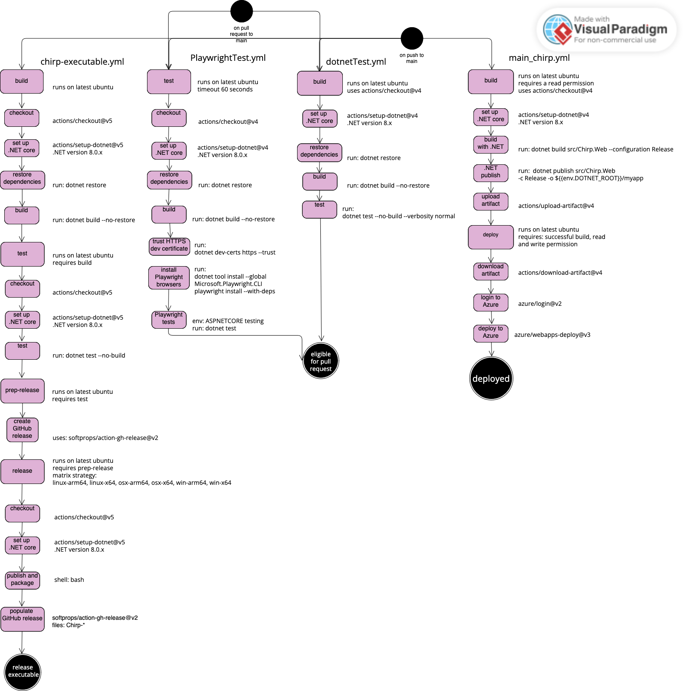
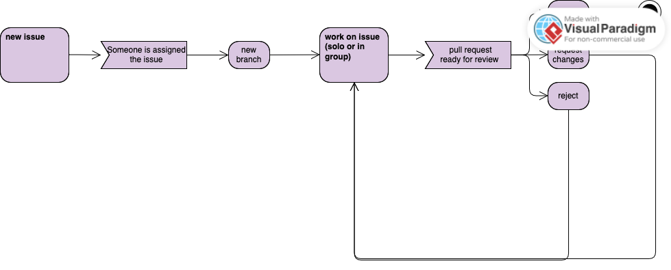
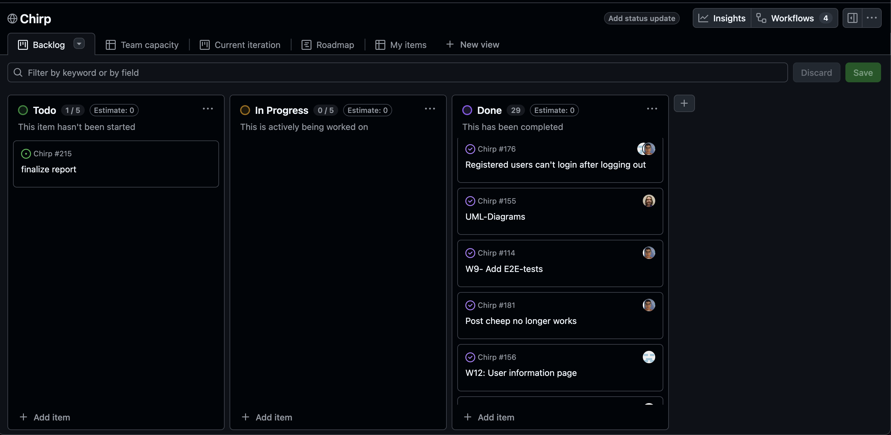
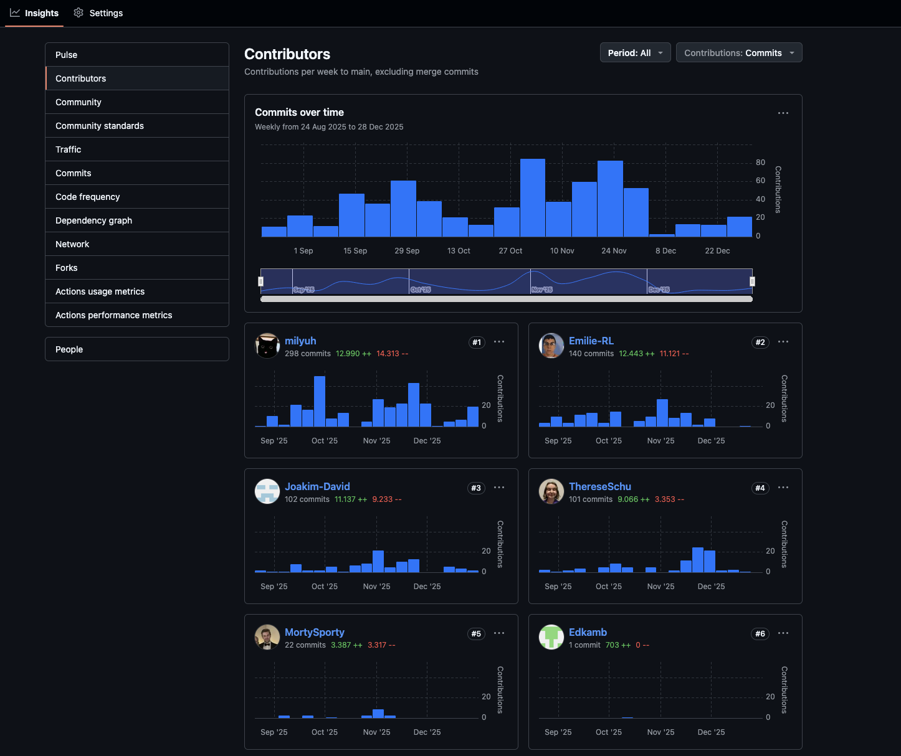

# Design and Architecture of _Chirp!_
The architecture of the application follows an onion structure, partitioning the src folder into three subfolders: Chirp.Core, Chirp.Infrastructure and
Chirp.Web. These represent the different layers of the program where Chirp.Core resides as the base of the program, defining the entity classes as well
as their complementing Data Transfer Objects (DTOs) without having references to Chirp.Infrastructure or Chirp.Web, keeping the core independent 
from other classes. 

The core is then used by Chirp.Infrastructure which handles queries to the database, and transferal of data. This gives functionality to the application.

Chirp.Infrastructure is used by the main part of the program, Chirp.Web, which allows a user to interact with the application.
Chirp.Web thus contains a reference to Chirp.Infrastructure

All this will be explained in detail in the following chapter, beginning at the center of the onion: The domain model

## Domain model



The domain model in Chirp.Core consists of two primary entities: Author and Cheep. 
The Author class extends the standard ASP.NET Core Identity IdentityUser class.

This inheritance provides built-in security attributes such as:
- UserName
- Email
- GUID-based Id

while adhering to industry standards for authentication.

Additionally, the Author class adds collections of authors whom a user is following and their followers. 
It also adds collections of cheeps posted by an author, 
as well as liked and disliked cheeps—all specific attributes for our application. 
This behavior represents a one-to-many relationship between an author and their posts, 
as well as other cheeps they have liked or disliked.

The Cheep class represents the fundamental unit of communication within the system. 
The entity contains information about the Cheep itself and the author, such as:
- CheepId: An identifier unique to the cheep.
- Text: The content of the cheep, limited to 160 characters.
- Author: The Author entity that created the cheep; this acts as a foreign key.
- Timestamp: The time at which the cheep was created.

Much like the Author entity, the Cheep entity also contains collections of authors 
who have liked and disliked the Cheep—all specific attributes for our application.


## Architecture — In the small


Above figure illustrates the onion architecture which the Chirp! Codebase is built upon. Dependencies flow exclusively inward, ensuring loosely coupled layers with inverted control. The application is structured into the three following layers:

- Chirp.Core: This layer is the innermost layer of Chirp. Containing the Domain Model and the Data transfer Objects. Chirp.Core has no external dependencies.
- Chirp.Infrastructure: Manages data persistence and retrieval, this data access interface is implemented using Entity Framework Core. This layer also encapsulates application logic. It manages data flow between the user interface and the repositories. 
- Chirp.Web: The outermost layer constraining the razor pages for user interaction.

This structure ensures the application is loosely coupled, maintainable and testable


## Architecture of deployed application


The deployed application is hosted on Azure Web Services. 
The application is deployed from GitHub via an auto-generated workflow file.
The application relies on an SQLite database file.

## User activities


The following section describes how a user navigates through the Chirp application
from registering a new account to navigating the different timelines, interacting with other users and finally deleting an existing account.

### 1. Start up
Upon opening the website the user is presented with the Public Timeline. Here the user can view Cheeps from other authors but is unable to interact with them. 
Via the buttons in the banner the user is then presented with two options.
* Login
* Register

Should the user choose the login option they are prompted to login with an existing account.
If however the user chooses register they are prompted for a Username and Email both of which must be unique within the system. Additionally the user must create a password that meets the following security criteria:
* Minimum 6 characters.
* At least one uppercase and one lowercase letter.
* At least one number.
* At least one special character.

Once on the login page the user also has a third option
* Login with github

This allows the user to login via their github account.

### 2. Timelines
Once logged in, the user is redirected to the public timeline. Here Cheeps from all users are displayed along with their respective likes and dislikes.
From here the user can perform the following actions.

* Write and publish their own Cheeps.
* Like or dislike Cheeps.
* Follow other authors.

The user can switch to their private timeline. This view filters the content to only show.
*  The user's own Cheeps.
*  Cheeps from authors the user is following.

If the user decides to unfollow an author while on their own private timeline the page refreshes and that author's Cheeps immediately disappear from the private timeline.

Clicking on another author's username in either the public or private timeline will link directly to their timeline showing all their cheeps.
### 3. About me.
The user can access the about Me page from the banner at any time. This section displays the user's profile information
* Username
* Email
* List of followed accounts.

At the bottom of this page the user finds the forget me button.
Once pressed The user's Name and Email are anonymized in the database effectively deleting their account,
the user is then immediately logged out and the user will be unable to log back in with the anonymized credentials.

All cheeps from the deleted account will also be invisible and inaccessible for all remaining users.
### 4. Logout
Finally a user can choose to perform a standard logout. This returns them to the initial unauthenticated state on the Public Timeline, where they can choose to log in again or register a new account.


## Sequence of functionality/calls trough _Chirp!_ 

The first UML sequence diagram shows the flow of calls and responses that occurs when an unauthorized user accesses
the public timeline on the Chirp! web app.
Although all messages passed along the lifelines are in reality asynchronous, 
they are reflected as being synchronous in the diagrams, as it was not possible to change the look of the arrowheads.
When cheeps are retrieved from the database, each cheep's likes and dislikes are also fetched. Although unauthorized 
users cannot like nor dislike cheeps, they are still viewable to the logged-out user.

<br>
The second UML sequence diagram shows the flow of messages that occur when an authorized user starts following another
user. This example is included to show how the program handles an HTTP POST-request.

# Process

## Build, test, release, and deployment


### Test

There are two main workflows, PlayWrightTest.yml and dotnetTest.yml, which test the program. These were used for automatically testing pull-requests, such that if the tests
fail the pull-request is automatically rejected until all tests pass. There were some issues with automatically testing the PlayWright-tests and
therefore there is a separate workflow specifically for these tests.

### Release

The workflow responsible for generating releases, chirp-executable.yml, was originally only activated upon pushes to main with tags.
But as time would tell git was a new routine and adding tags to pushes ended up being mostly forgotten.

Near the end of the project we realised that it is actually possible to get the workflow to auto-generate tags, and 
this would then have been a useful optimisation for us. So even though it is a bit late, we did remake the chirp_executable.yml
workflow to autogenerate tags for releases.


### Deployment
The workflow-file responsible for the deployment is main_chirp.yml.

There were a lot of issues with getting Azure to run the deployed application, this was solved by adding
a startup command on Azure. Without this the Web App did not run the program.

The startup command is simply `dotnet Chirp.Web.dll`.

Secondly because the application relies on an SQLite database-file, which is not "sent" to Azure as part of the deployment,
the database file should be created if the program is run without an existing file.
This code was added in Chirp.Web.Program.cs.
As a result of this the SQLite database file is regenerated on every deployment, this means that user data and cheep data is only persistent within a deployment.
When a new feature is merged into main, resulting in a new deployment, all users and cheeps not specified in the DbInitializer-file are lost.


## Team work

The following chapter explains the working process and the decisions made while working on Chirp! as a team

## Development Process

The above diagram illustrates the typical flow from creation of a new issue to a push to main. As we strived to complete
all issues the reject option on a pull request also leads back to work on the issue.

## GitHub

The group used different functionalities on GitHub to help coordinate the responsibilities of different members as well as
keeping track of the weekly project requirements.

The usage of project-boards, issues, code-review and actions enabled the group to coordinate its efforts as well as gaining
familiarity with how to use these tools to write code and produce cohesive projects in larger groups.

As can be seen from the picture of our project board mostly all issues have been resolved and at the writing of this
only the finalizing of the report is missing as well as a bug which has been hard to replicate and therefore work on this bug was 
not prioritised over the report.

To start with the main focus was in particular on following trunk-based-development. This meant trying to keep branches focused on smaller
system changes and frequent pull requests. In the end this did not end up being proper trunk-based-development as branches were typically active
for a few days up to a week. We felt this was okay considering we were balancing this project as well as other courses simultaneously.

All group members had prior git experience from the first year project, but even so there was a bit of a difference with regards to how often changes
would be commited. This can be seen in the uneven commit statistics on the GitHub repository page. Another factor in the uneven statistics is a result of
forgetting co-authors when pair programming, but as will be mentioned later this was mainly an issue at the beginning of the project.

Issues were a bit more unfamiliar to some members and to start with the issues were copy-pasted from the project-requirements. 
But after meeting with the TA there came an increased focus on rewriting the project-requirements in to actual issues. 
This helps keep track of why different changes are necessary, what smaller tasks are required to ensure that the overall issue is resolved as well as keeping track of which issues are the most
pressing.

Another beneficial rule to follow is keeping main protected. This way code changes can only be added to main after a minimum of one approving review.
This is good because otherwise you might overeagerly push changes to main without double-checking whether these changes are actually sound. 
This also forces the reviewing group member(s) to take a critical look at the code and ensures that members feel more responsible for 
all aspects of the code and are aware of changes made to the code and/or file structure of the project.

## Group Contract
While working on a group project such as Chirp!, it is important for the group to reach a consensus regarding the work process and expectations for the final product. Usually, this is done via a group contract drafted before work on the project begins.
A contract can be of great benefit in resolving issues that may arise during the working process. It provides individual members with a concrete reference point if one or more members are not living up to the agreed-upon standards.
For Chirp! however, the group decided to forgo a physical contract and rely simply upon a verbal agreement. 

This decision was based on the pre-existing relationships within the group and a history of previous group projects completed by several of the members. It was agreed that should problems arise during production, the ideal solution would be an internal dialogue to resolve them.
Ultimately, the lack of a formal group contract did not present a problem, as no significant conflicts occurred during the work process.


## Pair Programming 
During the project, the groups were encouraged to make use of pair programming, a development style that involves a "Driver" and a "Navigator." The Driver writes the code, while the Navigator dictates what needs to be done and reviews the work. These roles should be swapped at frequent intervals.
This method of coding resonated with the group and was heavily used during production.
An important aspect of pair programming is that both parties should be credited on joint commits. This ended up being the only issue the group faced regarding this workflow as co-authorship was often forgotten during the first half of the project skewing the number of commits attributed to each member.


## How to make _Chirp!_ work locally
Git must be installed, as a prerequisit for the following steps.
Once installed, the following command can be run, to clone the repository.
```
git clone https://github.com/ITU-BDSA2025-GROUP11/Chirp.git
```
After cloning the repository, user-secrets must be set up to authorize third-party login.
Locate the freshly cloned repository on your device and navigate to the ```src/Chirp.Web/``` directory.

Before setting up user-secrets. Ensure dotnet-ef is installed. This step can be skipped, if ef is already configured.
```
dotnet tool install --global dotnet-ef
```
From the ```/Chirp.Web/``` directory, run the following commands to setup the user-secrets.
```
dotnet user-secrets init
```
```
dotnet user-secrets set "authentication:github:clientId" "Ov23ctwQATqvMi87GmtN"
```
```
- dotnet user-secrets set "authentication:github:clientSecret" "e04c4c4cf97ccb87946a3a0e9ee9080ac0528995"
```
To confirm thats user-secrets has been setup successfully, the fowllowing command can be run from the Chirp.Web directory.
```
dotnet user-secrets list
```
Which should output both the authentication:github:clientsecret and authentication:github:clientID

With all the prerequisit for running the program locally done, the program can be run from the chirp.Web 
directory in the terminal, using the following command
```
dotnet run program.cs
```

## How to run test suite locally 
This chapter assumes you have followed the previous chapter and setup user-secrets and the required dependencies.

Tests should be run from the project rooty ```/Chirp/```. However First, build the test project to generate the installation script. 
Run the following command from the root directory:
```
dotnet build
```

Playwright is required to successfully run the End2End-Tests. To install Playwright, run the following command from the ```
/Chirp/``` directory
```
pwsh test/WebTest/bin/Debug/net8.0/playwright.ps1 install
```
The website msut be running locally, for the playwrigt test to successfully run. 
Run the project from ```src/Chirp.Web/``` with the command ```dotnet run```

Having completed the prerequisite for the test to run, we can finally execute the tests.
Run the test from the ```/Chirp/``` directory, using the following command:
```
dotnet test --no-build
```

This should run the enitre test-suite, consisting of unit tests, Intergration tests and End2End tests.

# Ethics
The development of modern software systems requires careful ethical consideration. This chapter examines the ethical framework adopted for the Chirp project focusing on two primary areas.
the selection of an appropriate open-source license and the integrity of authorship in the age of AI.
With the growing prevalence of Large Language Models (LLMs) in software engineering establishing clear boundaries for AI assistance was paramount. This section details the group's policy on transparency and evaluates adherence to these guidelines throughout the development lifecycle.


## License
The decision to adopt the MIT License for the project was based on two primary factors:

* The scope of the application
* The educational nature of the project

With these two factors in mind, the simplicity of the MIT license was ideal for a project of relatively small scope as it is easy to implement, and future developers only need to read a small paragraph to fully understand the parameters of the license.

The most significant consideration, however, was the project’s educational context. As it is unlikely, parts of Chirp would be used in a high-stakes commercial environment it was prioritized to take future students of the course into consideration. The MIT license ensures that future students can study, modify, and take inspiration from our implementation without fear of legal repercussions.


## LLMs, ChatGPT, CoPilot, and others
From the outset of the project the decision was made to keep the use of Large language models (LLMs) to a minimum during the development of the Chrip application.
Should the need for AI assistance arise during development the group would handle it with transparency both internally
and by crediting the LLM as co-author in the given part of the code. 
This approach however, proved challenging in practice as ChatGPT does not have an associated GitHub account. As an alternative solution, the LLM was credited in writing within Git commit messages whenever its assistance was relevant.

The use of AI would turn out to be mostly unnecessary, however in some instances the development would reach a bottleneck and the group decided to consult ChatGPT. 
This was done during the creation of the chripDbContextFactory and the initial implementation of identity package.

Troubles also arose during the deployment of the application to Azure where LMMs were consulted but ultimately yielded no tangible solutions so here it was discarded.

When consulted, the LLM were used as a substitute for a teaching assistant providing guidance and explanations rather than generating concrete code implementations.

LLMs would also prove useful for interpreting and understanding large and complex error messages produced by JetBrains Rider, particularly during migration related issues encountered in the first half of the development process.

## Ethical conclusion
In the end the group successfully adhered to the core ethical principle set out for ourselves maintaining intellectual ownership. 
While the technical method of attribution had to be changed from co-authorship to commit message citations due to platform limitations the role of AI remained strictly supplementary. 
By treating LLMs as "teaching assistants" for debugging and explanations rather than code generators
we ensured that the final codebase remains a product of our own understanding and effort.